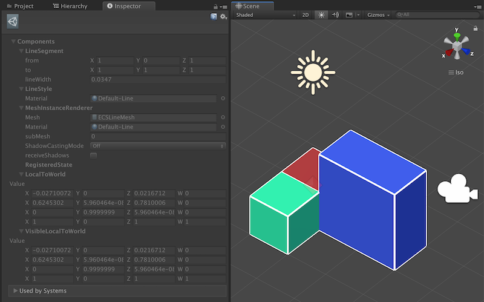
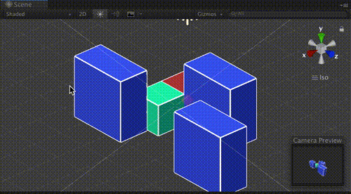

# ECS Line Renderer



ECS approach to render a line I made for personal use on commissioned non-game visualization work. The feature is not quite enough but I decided to open source it.

Coded with mostly archetype chunk iteration API since it will be the most resistant to API changes in this preview phase. So if you want to contribute, please try to stick to chunk iteration if it is a main thread work, and `IJobChunk` for worker thread. Thank you!

## How to include with GitHub functionality of Unity Package Manager

Add this line `"com.e7.ecs.line-renderer": "git://github.com/5argon/ECSLineRenderer.git",` to your manifest.json

It does not update automatically when I push fixes to this repo. You must remove the lock in your manifest.

## `LineSegment`

Generate a thin rectangle mesh that goes 1 unit in the Z axis. We could use z scale as line length, x scale as line width, position as line from, and rotation as line to. Assuming that this is only one segment of a line.

To construct complex lines, we create more `LineSegment` entity. They should be render instanced as they are using the same mesh. What's left is to wait for `HybridRenderer` to support material property block so we could change line color without a new material.

All lines are rotated to face the main camera in billboard rendering style.



## `LineStyle`

Without **both** `LineSegment` and `LineStyle`, you will not get `RenderMesh` attached because it needs to know which material you want.

## `BillboardCameraProxy`

If you don't add this to one of your `Camera`, the lines don't know which camera to rotate to.

## Rendering

The rendering is handled by `HybridRenderer` package, by generating `RenderMesh` shared component data for all your lines. So this package's work are all in simulation system group.

For someone that is always looking for "pure ECS" approach to everything, no, it is not possible to see something on the screen in pure currently. Even the package is named **hybrid** renderer. I suggest you just drop the pure/hybrid wording altogether and just use what's the best.

## Minimum code to get a line from nothing

```csharp
var e = EntityManager.CreateEntity();
EntityManager.AddComponentData(e, new LineSegment(math.float3(1, 1, 1), math.float3(1, 2, 1)));
var mat = UnityEditor.AssetDatabase.LoadAssetAtPath<Material>("Assets/ECSLineRenderer/SampleLineMaterial.mat");
EntityManager.AddSharedComponentData(e, new LineStyle { material = mat });
```

## Info

- Line width is in Unity's standard grid unit.
- If position from and to are the same the system will not update the line. (Stays at previous position)
- It came with a bonus `LineSegmentProxy` and `LineStyleProxy` so you could play with it in the scene/edit mode with hybrid ECS.

## Systems

- `LineSegmentRegistrationSystem` : The logic which you create `LineSegment` entity should come before this system.
- `LineSegmentTransformSystem` : Update your `LineSegment` from-to location before this system's update.

## Limitations + problems

Please see [Issues](https://github.com/5argon/ECSLineRenderer/issues) section.

# This asset is sponsored by

My own other (paid) assets... haha. Asides from code contribution, you could also provide support by getting something from these. Thank you.

- [Introloop](http://exceed7.com/introloop/) - Easily play looping music with intro section (without physically splitting them) (Unity 2017.0+)
- [Native Audio](http://exceed7.com/native-audio/) - Lower audio latency via OS's native audio library. (Unity 2017.1+, iOS uses OpenAL / Android uses OpenSL ES)
- [Native Touch](http://exceed7.com/native-touch/) - Faster touch via callbacks from the OS, with a real hardware timestamp. (Unity 2017.1+, iOS/Android)