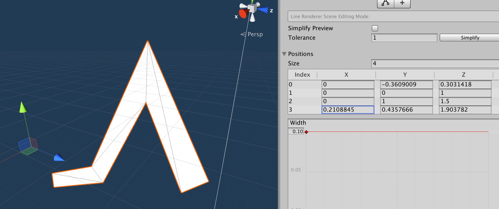

# ECS Line Renderer


ECS approach to render a line I made for personal use on commissioned non-game visualization work. The feature is not quite enough but I decided to open source it.

Coded with mostly archetype chunk iteration API since it will be the most resistant to API changes in this preview phase. So if you want to contribute, please try to stick to chunk iteration if it is a main thread work, and `IJobChunk` for worker thread. Thank you! (With `IJobChunk` instead of `IJobForEach`, we could control chunk version bumps and add some `DidChange` optimizations.)

## How to include with GitHub functionality of Unity Package Manager

Add this line `"com.e7.ecs.line-renderer": "git://github.com/5argon/ECSLineRenderer.git",` to your manifest.json

It does not update automatically when I push fixes to this repo. You must remove the lock in your manifest.

## Core idea

I want to find a new way to render an imperfect yet efficient line by trying to leverage geometry instancing and ECS together.

A typical line renderer works by triangulation of a set of connecting points. For example Unity's `LineRenderer` always create 2 triangles per one pair of point regardless of their angle.



Per 1 line with any number of points Unity generated 1 unique mesh. But, this mesh is unlikely to be the same as other lines, it could not be rendered by instancing due to different mesh. (Even though they could be batched by the same material.) Also if you want to animate line's points, every little movement would need an entire mesh regenerated.

In this package, I want to try using the same mesh as much as possible to assemble a line that could be instanced. I am aware that this may produce an ugly looking line especially the corner if I decided to just overlap rectangles (and it wouldn't work well for non-solid material), but I think it is an interesting experiment and could be useful for some cases, like a line small enough that the defects aren't that visible in exchange of performance. And lastly, I would like to be able to move each point on the line without mesh regeneration at all. Application includes an efficient wireframe,  a good base for application like animated graphs, or just drawing grids/tables in general.

The top image has overlapping corner which produces jagged look, but it looks acceptable at glance because the line is white and its width is small enough. Only when extremely zoomed in that you start to notice defects.

[See this issue for details](https://github.com/5argon/ECSLineRenderer/issues/3).

## How it works here

It generate 1 piece of a thin rectangle mesh that goes 1 unit in the Z axis. We could use z scale as line length, x scale as line width, position as line from, and rotation as line to. Assuming that this is only one segment of a line.

`LineSegment` contains from-to absolute position in world coordinate. To construct complex lines, we create many `LineSegment` entity with connecting from-to. They should be render instanced as they are using the same mesh. Line width is also on this component.

The line then need a material. So you specify that on `LineStyle` `ISharedComponentData`. Without **both** `LineSegment` and `LineStyle` my systems will not work on them.

Finally all lines should be rotated to face the main camera in billboard rendering style. By attaching `BillboardCameraProxy`, the system will take this camera's transform into calculation. But currently I think the implementation is still incorrect it fails in many slanted camera angles.

```
// ECSLineRenderer

LineSegment -> Transform + NonUniformScale
LineStyle -> RenderMesh
BillboardCameraProxy -> Rotation

// Unity's built-in TransformSystemGroup

Transform + Rotation + NonUniformScale -> LocalToWorld

// Unity's Hybrid Renderer Package

LocalToWorld + RenderMesh -> You see things on screen.
```


## Rendering

The rendering is handled by `HybridRenderer` package, by generating `RenderMesh` shared component data for all your lines. So this package's work are all in simulation system group.

For someone that is always looking for "pure ECS" approach to everything, no, it is not possible to see something on the screen in pure currently. Even the package is named **hybrid** renderer. I suggest you just drop the pure/hybrid wording altogether and just use what's the best.

## Minimum code to get a line from nothing

```csharp
var e = EntityManager.CreateEntity();
EntityManager.AddComponentData(e, new LineSegment(math.float3(1, 1, 1), math.float3(1, 2, 1)));
var mat = UnityEditor.AssetDatabase.LoadAssetAtPath<Material>("Assets/ECSLineRenderer/YellowLineMaterial.mat");
EntityManager.AddSharedComponentData(e, new LineStyle { material = mat });
```

## Info

- Line width is in Unity's standard grid unit.
- If position from and to are the same the system will not update the line. (Stays at previous position)

### GameObjectEntity support

Attach `LineSegmentProxy` and `LineStyleProxy` which will in turn attach `GameObjectEntity`. You could then play with it in the scene/edit mode with hybrid ECS.

### GameObject Conversion / SubScene support

This is a new and preferred way to author ECS content. `GameObjectEntity` has a performance problem to maintain a link to `GameObject`. `ConvertToEntity` has a problem that things disappear when you enter play mode if you want pure ECS at runtime (without inject mode, which would arrive the same performance problem) and also it is a problem in edit time that you don't know how it would end up.

SubScene is the best of both worlds. Things with `IConvertGameObjectToEntity` inside SubScene get converted in play mode like `ConvertToEntity`, but they remains touchable in Hierarchy and anytime you do something they will get reconverted seamlessly. It feels like old `GameObjectEntity` approach except instead of synchronization it keeps reconverting in one way, then in the real build it works like pure ECS since you cannot touch Hierarchy in the real build.

I have added `LineAuthoring : IConvertGameObjectToEntity` for this. See the green line in sample scene how this get converted to `LineSegment` and `LineStyle`. Since all systems here has `[ExecuteAlways]`, you can turn on `DOTS > Live Link Mode > Live Link Conversion in Edit Mode` then choose SceneView mode you like to see SubScene in action even in edit mode.

## Systems

- `LineSegmentRegistrationSystem` : Having both `LineSegment` and `LineStyle` on the same `Entity` will qualify for a registration, which you will get a `RenderMesh` with migrated material from your `LineStyle` plus other TRS components.
- `LineSegmentTransformSystem` : Calculate TRS which would then turns into `LocalToWorld` then `RenderMesh` use it. Based on information in `LineSegment`. Move your line by changing `LineSegment`'s data before this system.

## Limitations + problems

Please see [Issues](https://github.com/5argon/ECSLineRenderer/issues) section. For instance, currently the billboard rotation is wrong. If anyone understand http://www.opengl-tutorial.org/intermediate-tutorials/billboards-particles/billboards/ you can send PR.. thanks.

# This asset is sponsored by

My other assets.. other than pull requests you can contribute by getting these. Thank you.

- [Introloop](http://exceed7.com/introloop/) - Easily play looping music with intro section (without physically splitting them) (Unity 2017.0+)
- [Native Audio](http://exceed7.com/native-audio/) - Lower audio latency via OS's native audio library. (Unity 2017.1+, iOS uses OpenAL / Android uses OpenSL ES)
